# Hull Market Prediction

## Overview
We predict next day market return and choose a daily allocation to the S and P five hundred. The goal is to beat the index while keeping volatility within one hundred twenty percent of the market. The metric is a Sharpe like score that punishes excess volatility and underperformance.

## Problem statement
We predict forward returns and forward excess returns over the risk free rate. We output a daily allocation between zero and two. We want better return than the index under the volatility limit. We use the daily features provided by the competition.

## Data
Train has eight thousand nine hundred ninety rows and ninety eight columns. The feature families are D E I M P S V. Targets are forward_returns and market_forward_excess_returns. Family D has no missing values. Families M S V E have notable missing values.

## How to run
Open the notebook named hull_tactical_eda.ipynb. Place the data in the path used by the notebook or update the paths. Run all cells. The figures below are saved in figs.

## EDA summary with visuals

### Next day excess returns over time
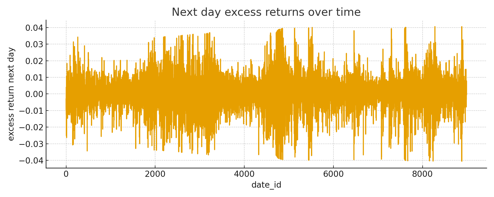  
The series is noisy. Large moves cluster. This shows regime shifts.

### Rolling mean window sixty three
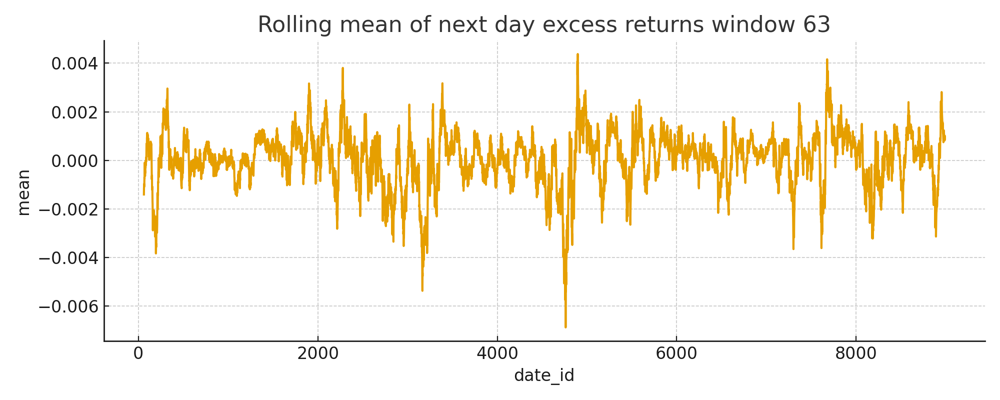  
The mean stays near zero. Local trends drift over time.

### Rolling annualized volatility window sixty three
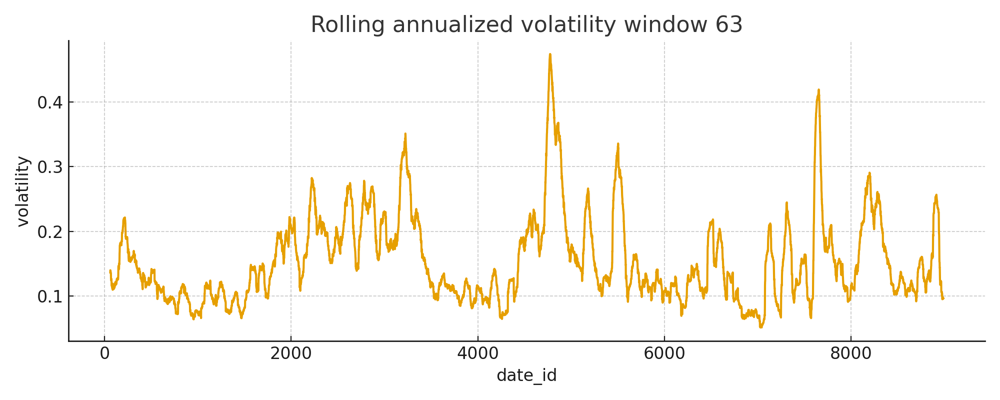  
Risk is time varying. There are calm and active zones.

### Autocorrelation of next day excess returns
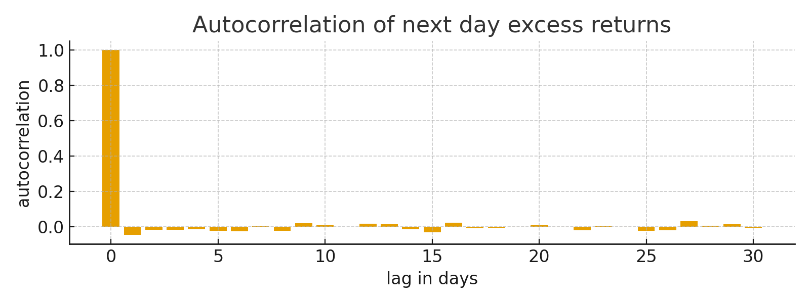  
Lag one is negative near minus zero point zero four. This is mild mean reversion.

### Distribution of next day returns
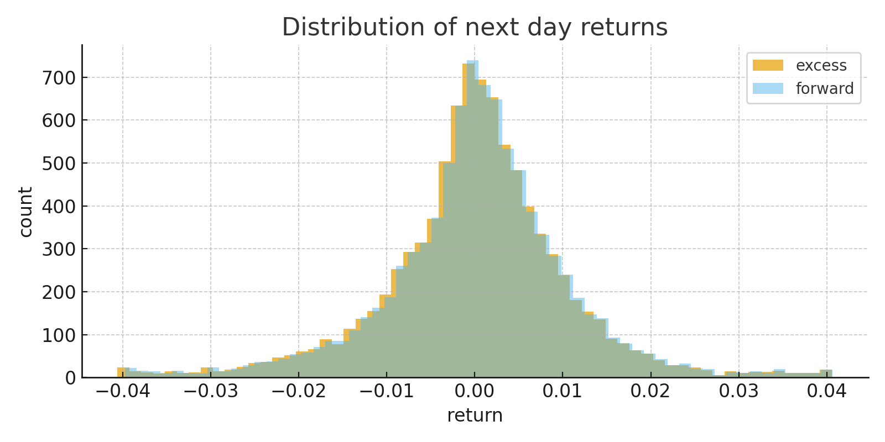  
The center is near zero. One percent standard deviation is typical. Tails reach about three percent.

### Top twenty absolute correlations with next day excess
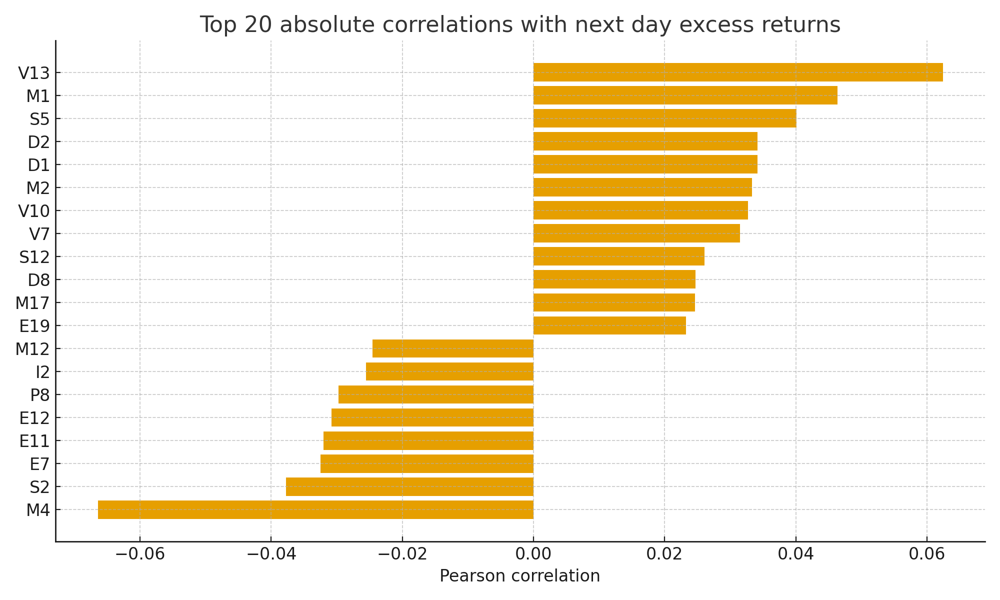  
Signal size is small but present. Stronger links appear in D and M. V has a few stand out features.

### Decile curve for M four
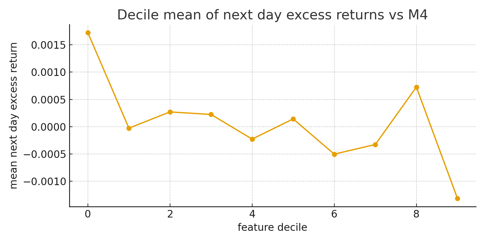  
Low deciles have positive next day excess. High deciles have negative next day excess. This shape supports a mean reversion rule.

### Decile curve for V thirteen
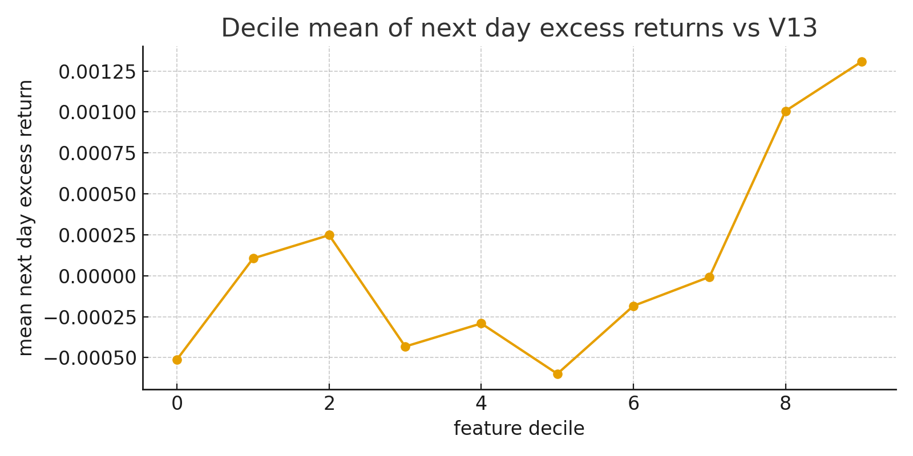  
Higher deciles map to higher next day excess. This shape supports a trend rule.

### Decile curve for M one
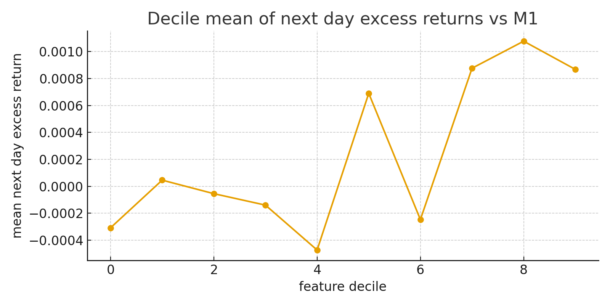  
The curve rises across deciles. This also supports a trend rule.

### Mean next day excess by volatility regime
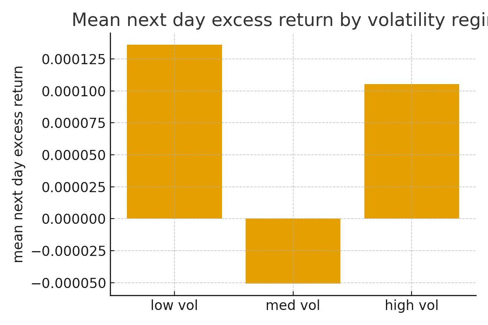  
Low and high volatility regimes have a small positive mean. The mid regime has a small negative mean. This supports a vol aware allocation.

### PCA cumulative explained variance
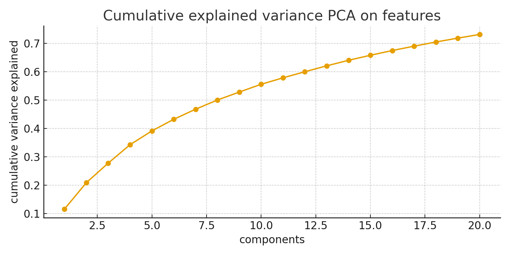  
Many components are needed. The space is not very low rank.

### Missingness heatmap for top missing features
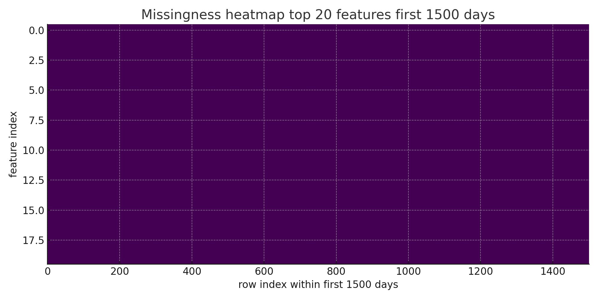  
Families E M S V show blocks of missing data. Plan imputation with time safe logic.

## Key numbers
Mean next day excess return is near zero with a small positive tilt. Daily standard deviation is near one percent. Lag one autocorrelation is about minus zero point zero four five. Top absolute correlations in sample include M four near minus zero point zero six six and V thirteen near plus zero point zero six two and M one near plus zero point zero four six. Treat these with care.

## Files
The notebook is hull_tactical_eda.ipynb.  
Figures are in figs.  
The table for the top twenty correlations is figs slash zero six underscore top twenty underscore abs underscore corr underscore table dot csv.

## Next steps
1. Use time safe cross validation with purge and embargo  
2. Impute missing values with forward safe methods  
3. Start with features from D and M and selected V features with stable shapes  
4. Try linear with regularization and tree based models and simple bins for non linear effects  
5. Track realized volatility of the allocation and keep it within the limit  
6. Blend decorrelated signals and test in rolling windows out of sample
