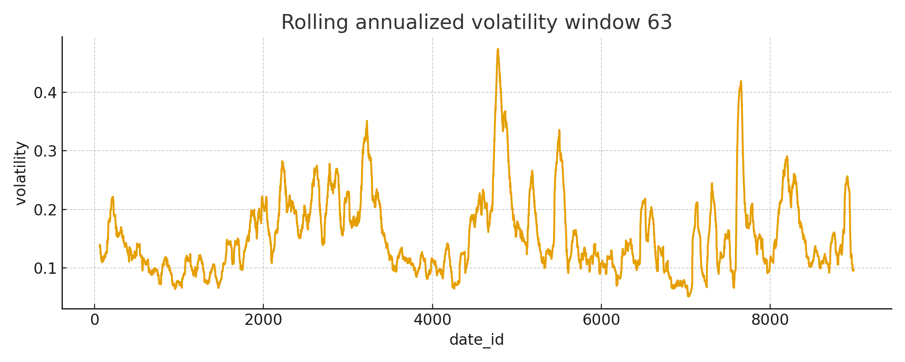
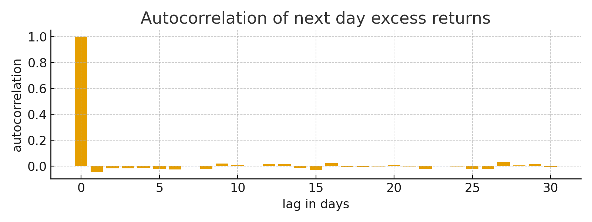
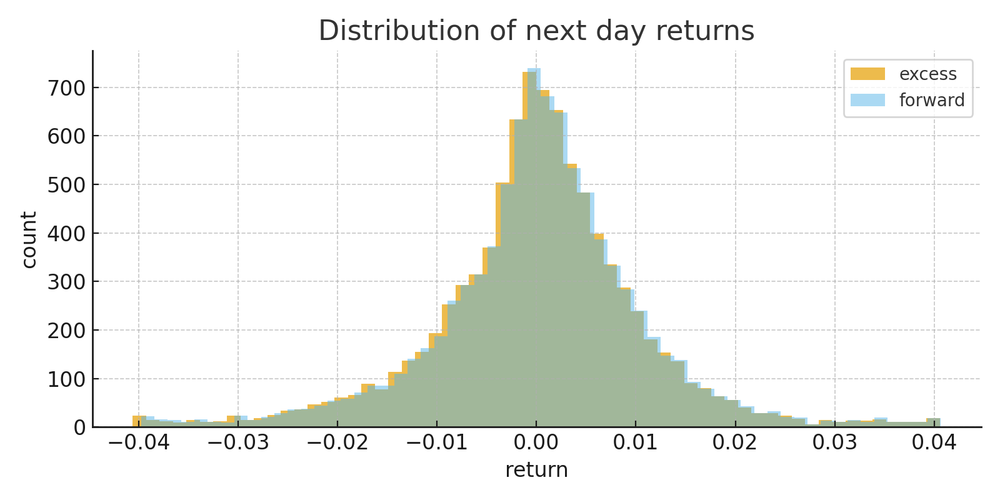
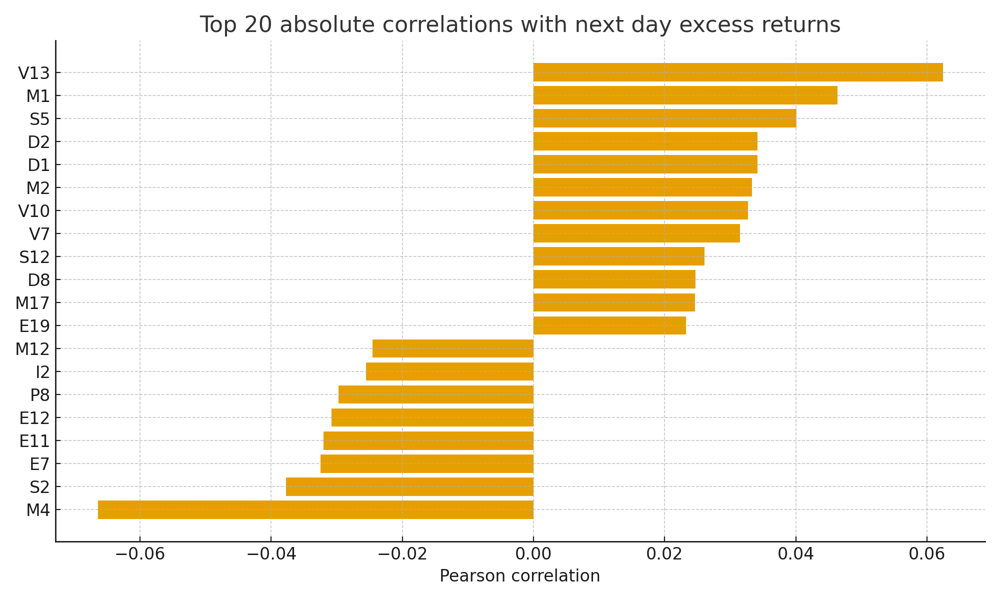
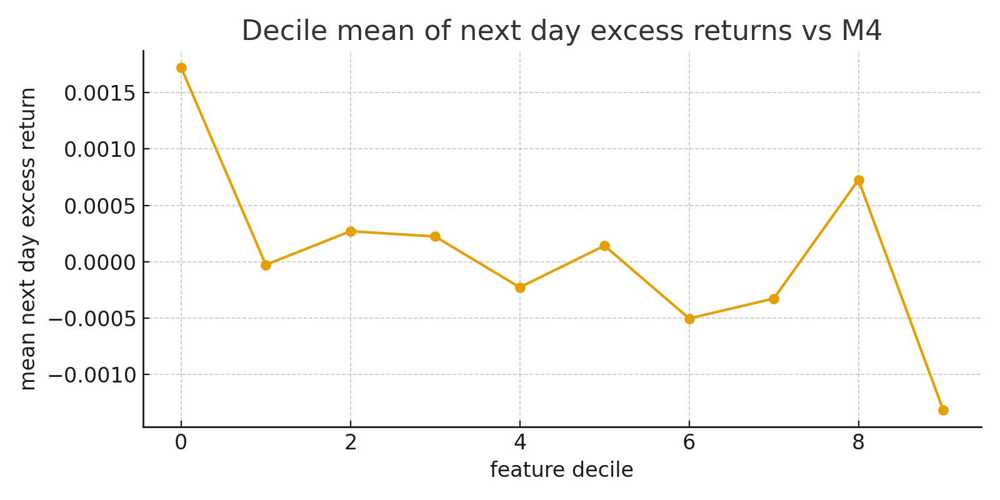
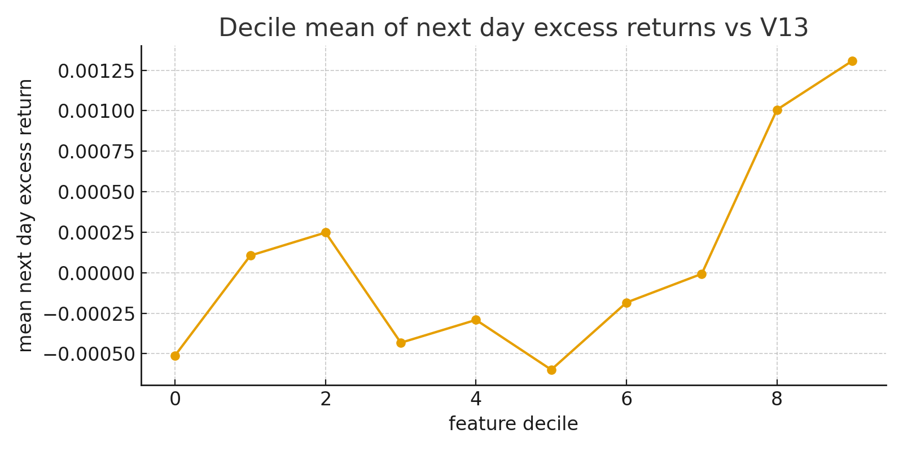
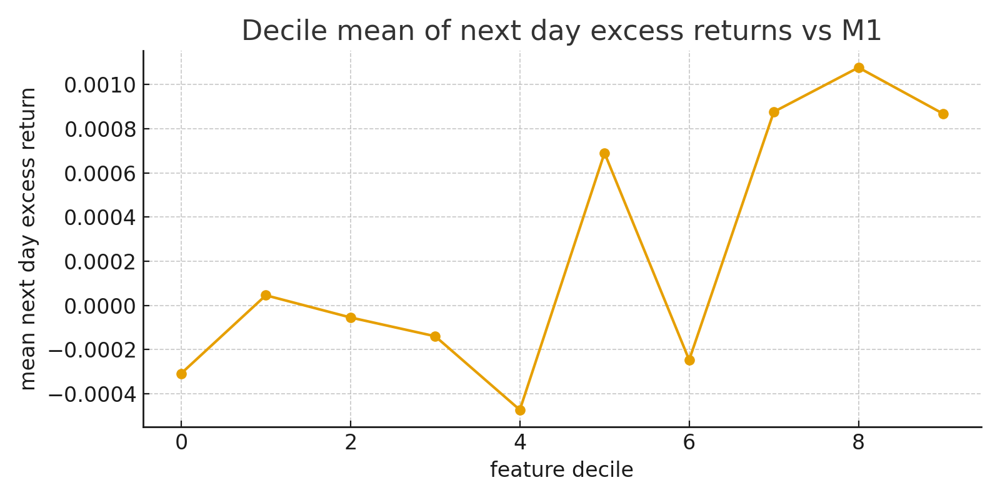

# Hull Market Prediction

## Overview
We predict next day market return and choose a daily allocation between zero and two. The competition evaluates a portfolio style score that rewards higher mean excess return but penalizes excessive volatility. Our work includes exploratory data analysis and a set of models that forecast next day market forward excess return and then map those forecasts to a position in [0, 2].

## Problem statement
We predict forward returns and forward excess returns over the risk free rate. From those forecasts we derive a daily allocation between zero and two. We want better return than a neutral allocation with volatility close to the given limit. We also want models and mapping rules that are stable across market regimes.

## Data
Train has eight thousand nine hundred ninety rows and ninety eight columns. Each row is a trading day. The target columns are `forward_returns`, `risk_free_rate` and `market_forward_excess_returns`. Features belong to families `M*` (market and technical), `E*` (macro), `I*` (rates), `P*` (valuation), `V*` (volatility), `S*` (sentiment), `MOM*` (momentum) and `D*` (binary).  
Test has the same features, plus lagged label features `lagged_forward_returns`, `lagged_risk_free_rate` and `lagged_market_forward_excess_returns`. In our code we create the same lagged columns in train so that train and test share the same schema.

Missing values are common in some families, especially early in the history. In the modeling code we drop columns with very high missingness or near zero variance and then use median imputation for the rest.

## Repository layout

- `hull_tactical_eda.ipynb`  
  Exploratory data analysis. This notebook reproduces the figures that appear in the report and README. It looks at distributions, autocorrelation, rolling volatility, top correlations, decile curves and missingness.

- `hull_tactical_modeling.ipynb`  
  Main modeling notebook. It uses the reusable helpers in `src/pipeline.py` to train several models on the same target:
  - ElasticNet anchor model  
  - Ridge with top correlation feature pre selection  
  - RandomForest on a restricted set of core features (`M*`, `V*`, `MOM*`, `S*` and lagged labels)  
  - PCA plus Ridge  
  - PLS regression  
  - HistGradientBoosting  

  For each model we run time aware cross validation, select a mapping scale `k` under a volatility cap, optionally fit an isotonic calibration on out of fold predictions and finally train on the full history.

- `src/pipeline.py`  
  Shared code for preprocessing, time series cross validation, mapping and models. It includes:
  - `add_lagged_labels` to add the three lagged label columns to train  
  - `get_feature_columns` to intersect train and test columns and drop obvious non feature columns  
  - `drop_sparse_and_constant` to keep only columns with enough coverage and non zero variance  
  - `make_elasticnet_model`, `make_ridge_model`, `make_rf_model`, `make_pca_ridge_model`, `make_pls_model`, `make_hgb_model` for model construction  
  - `time_series_cv_indices` for walk forward index splits with a gap  
  - `evaluate_k_grid` and `train_with_cv_and_k` to pick the mapping scale `k` that maximizes mean position times return under a volatility cap  
  - `predict_positions` to turn a trained model and input features into positions in [0, 2].

- `figs/`  
  Static images and the CSV table from the EDA notebook.

## How to run the notebooks

1. Download the competition data from Kaggle and place `train.csv` and `test.csv` under `data/hull-tactical-market-prediction/`.
2. Open `hull_tactical_eda.ipynb`. Run all cells to recompute summary tables and figures. The figures are saved into the `figs` directory.
3. Open `hull_tactical_modeling.ipynb`. Run all cells. For each model you will see a short summary of the mapping scale `k` selected on cross validation. At the end the notebook prints the mean return and volatility ratio of a simple equal weight blend of positions across all models.

The modeling notebook is designed to be run locally or in a Kaggle Notebook with Internet disabled.

## EDA summary with visuals

### Rolling annualized volatility window sixty three
  
Risk is time varying. There are calm and active zones.

### Autocorrelation of next day excess returns
  
Lag one is negative near minus zero point zero four. This is mild mean reversion.

### Distribution of next day returns
  
The center is near zero. One percent standard deviation is typical. Tails reach about three percent.

### Top twenty absolute correlations with next day excess
  
Signal size is small but present. Stronger links appear in D and M. V has a few stand out features.

### Decile curve for M four
  
Low deciles have positive next day excess. High deciles have negative next day excess. This shape supports a mean reversion rule.

### Decile curve for V thirteen
  
Higher deciles map to higher next day excess. This shape supports a trend rule.

### Decile curve for M one
  
The curve rises across deciles. This also supports a trend rule.

## Key numbers
Mean next day excess return is near zero with a small positive trend. One day autocorrelation is around minus zero point zero four. Individual feature correlations are small, up to abs value near zero point zero seven. The largest absolute correlations appear in some D family and M family features and in a few V family features. Treat these with care.

## Next steps
1. Use time safe cross validation with purge and embargo (we already apply a small gap between train and validation splits).  
2. Extend rolling feature engineering and regime driven scaling in the modeling notebook.  
3. Explore more robust blending of models by solving a small mean variance optimization problem on out of fold returns.  
4. Track realized volatility of the allocation and keep it within the given limit.  
5. Keep the repository organized so that EDA, modeling code and report can evolve together.
